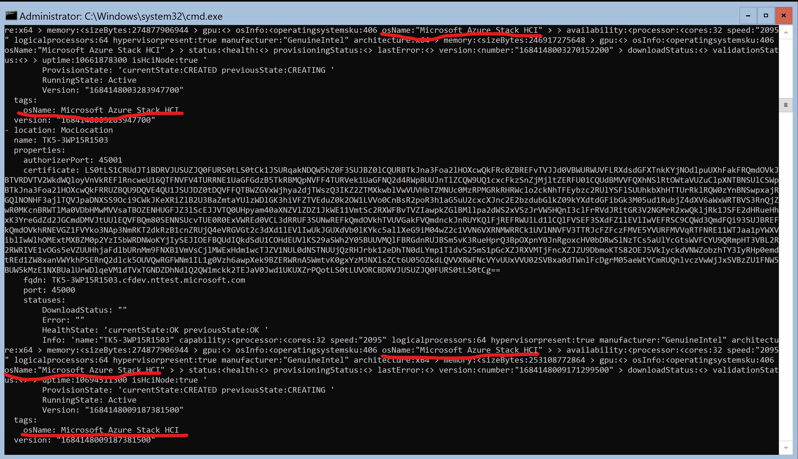
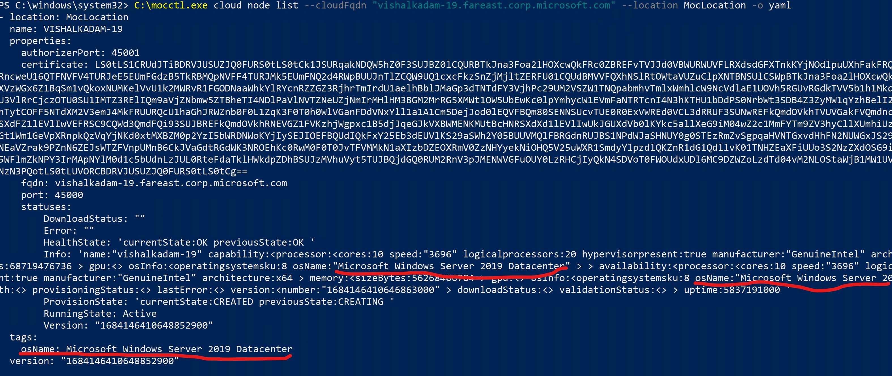

### Problem Statement

ARC enabled VMs isn't billed as a feature of HCI. This means ARC enabled VM doesn't have its own billing mechanism, it relies on the assumption that it runs on a properly registered HCI machine. Therefore, we need a mechanism in azstackhci-operator to prevent VM self-service to be installed on non-HCI hosts. For more details, please go through [this](https://dev.azure.com/msazure/msk8s/_sprints/taskboard/ARC-HCI/msk8s/archci/Gallium/2305?workitem=16575701) user story's description.

### Goal
Prevent execution of azstackhci-operator, in case one of the underlying node is non-HCI.

### Approach
There are few changes required in `moc-sdk-for-go`, `moc-pkg` and `moc`, which are common for approach 1 and 2 which are described below. Those are - 

* Adding a new field named as <b>IsHciNode</b> in `Moc`'s NodeInfo object(which is a field in `Moc`'s Node object).
* Setting the value of <b>IsHciNode</b> when wssdagent/nodeagent calls the <i>GetNodeInformation()</i> method from `moc-pkg`.
* Since NodeInfo is eventually converted to a `string` when we query for a Node object, processing this string might be a bit tricky. Hence, adding the value of <b>IsHciNode</b> as part of `moc-sdk-for-go`'s Node's <b>Tags</b> as well.

#### Approach 1
1. Call the `moc-sdk-for-go`'s <i>Get()</i> method for Node in a loop from azstackhci-operator, which will return all the Nodes.
2. Check the <b>Tags</b> of every Node. If any of the Node's Tags has the value of <b>hciNode</b> as `false`. If yes, fail the azstackhci-operator.

   This approach requires few more changes like creating the `controllerconfig` Secret in `azstackhci-operator-system` so as to use the login token, add a new method in ArcHci.psm1 to rotate the token and couple of minor additional methods into the azstackhci-operator.

#### Approach 2
1. This will require intoduction of new CR in azstackhci-operator and moc-operator for Node object.
2. Hydrate the `moc-sdk-for-go`'s Node object to `moc-operator`'s Node object, and hydrate `moc-operator`'s Node object to `azstackhci-operator`'s Node object.
3. Read the value of <b>hciNode</b> from azstackhci-operator CR's Tags. If any of the value if `false`, fail the azstackhci-operator.

#### Approach 3
* Adding a new field named as `OsName` inside `Moc`'s OperatingSystem message, which is part of `Resources`, which in turn is part of NodeInfo. More specifically, add this field [here](https://github.com/microsoft/moc/blob/cff6c5762f9dff6e64e5e68914f0fc0b58bdbb22/rpc/common/moc_common_nodeinfo.proto#LL35C10-L35C10).
* Get the value of <b>Caption</b> property from WMI while getting the Operating System Info [here](https://github.com/microsoft/moc-pkg/blob/dcc4575ff626d790e460328e63e642066c1e365e/pkg/host/operatingsystem_windows.go#L32).
* <b>Caption</b> represents the `OperatingSystemVersion` and is a `read-only` string. Please see description of <b>Caption</b> [here](https://learn.microsoft.com/en-us/windows/win32/cimwin32prov/win32-operatingsystem#properties).
* Since NodeInfo is eventually converted to a `string` when we query for a Node object, processing this string might be a bit tricky. Hence, adding the value of <b>OsName</b> as part of `moc-sdk-for-go`'s Node's <b>Tags</b> as well.

    Output of `mocctl cloud node list` command gives the output as seen in the below screenshot.

   Detection of HCI Node can be done in below 2 ways - 

   1. Call the `moc-sdk-for-go`'s <i>Get()</i> method for Node in a loop from azstackhci-operator, which will return all the Nodes. Check the <b>Tags</b> of every Node. If a tag with key `osName` exists, get it's value and do some string searching/matching to check if the Node is a HCI Node. This approach requires few more changes like creating the `controllerconfig` Secret in `azstackhci-operator-system` so as to use the login token, add a new method in ArcHci.psm1 to rotate the token and couple of minor additional methods into the azstackhci-operator.
   2. This will require intoduction of new CR in azstackhci-operator and moc-operator for Node object. Hydrate the `moc-sdk-for-go`'s Node object to `moc-operator`'s Node object, and hydrate `moc-operator`'s Node object to `azstackhci-operator`'s Node object. Check the <b>Tags</b> of every Node CR. If a tag with key `osName` exists, get it's value and do some string searching/matching to check if the Node is a HCI Node.

### API used to detect if a Node is HCI

`SLGetWindowsInformationDWORD` api defined in `slpublic.h` which is part of `slc.dll` is used to detect if a Node is HCI or not. For more details, see - [SLGetWindowsInformationDWORD](https://learn.microsoft.com/en-us/windows/win32/api/slpublic/nf-slpublic-slgetwindowsinformationdword). We need to query for `AzureStackHCI-Enforce-Registration`'s value in the above api. See - [DWORD](https://microsoft.visualstudio.com/os/_git/os.2020?path=%2fonecore%2fmerged%2fsppdata%2fcertificates.windows%2fdefault%2fslpolicylist.h). The api on successful execution, returns 0. And the `DWORD` value, if 1, is a HCI Node.

### References
1. API used to detect if a Node is HCI - `SLGetWindowsInformationDWORD` api defined in `slpublic.h` which is part of `slc.dll` is used to detect if a Node is HCI or not. For more details, see - [SLGetWindowsInformationDWORD](https://learn.microsoft.com/en-us/windows/win32/api/slpublic/nf-slpublic-slgetwindowsinformationdword). We need to query for `AzureStackHCI-Enforce-Registration`'s value in the above api. See - [DWORD](https://microsoft.visualstudio.com/os/_git/os.2020?path=%2fonecore%2fmerged%2fsppdata%2fcertificates.windows%2fdefault%2fslpolicylist.h). The api on successful execution, returns 0. And the `DWORD` value, if 1, is a HCI Node.

2. https://learn.microsoft.com/en-us/windows/win32/cimwin32prov/win32-operatingsystem

